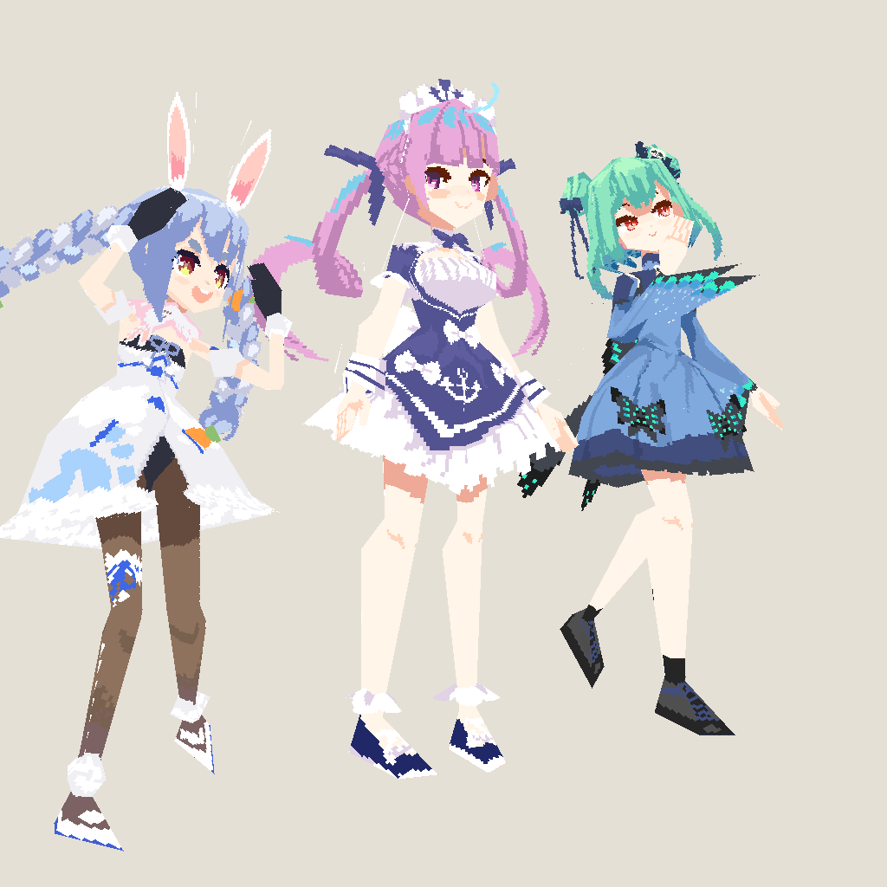
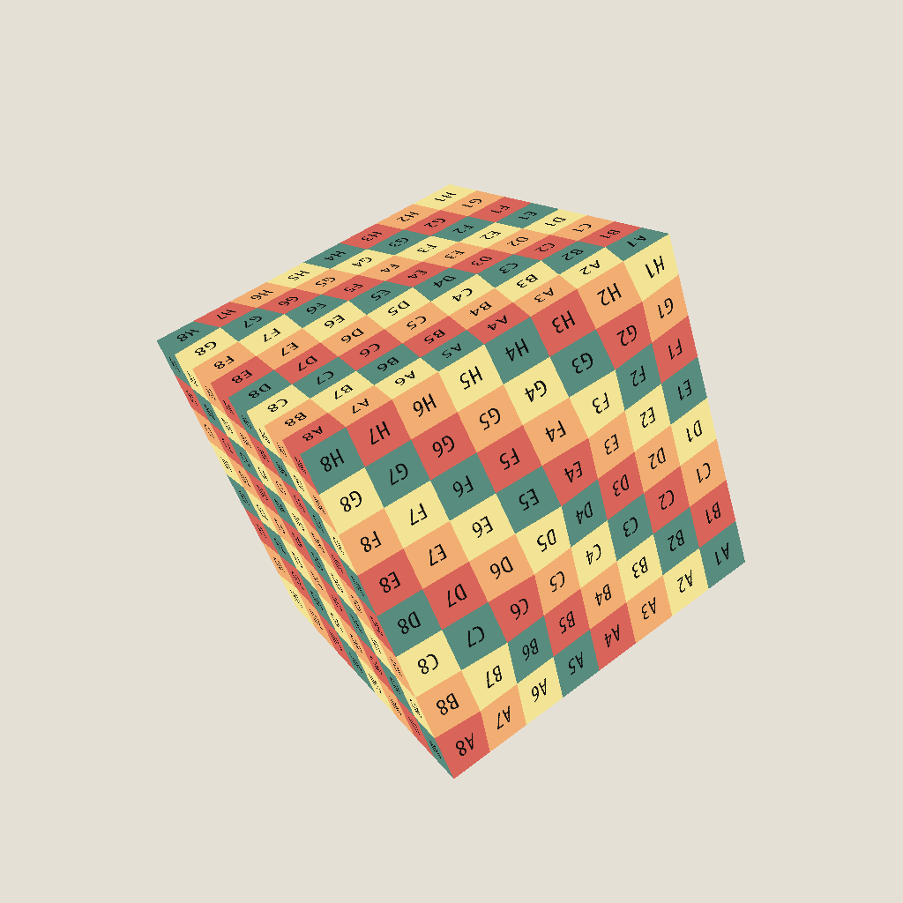
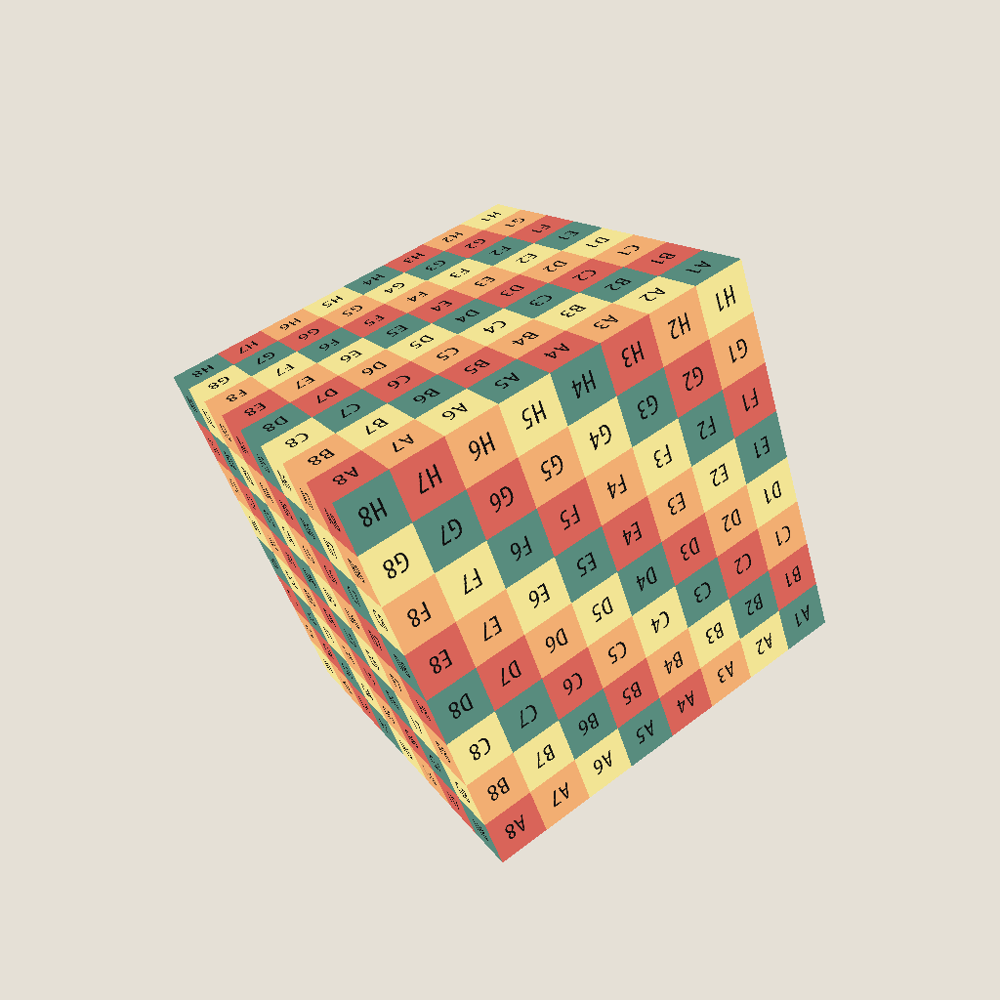

# Box
Box is an software rendering demo that shows how programming language and mathematics are applied in a basic technique of Computer Graphics, Rasterization, written in KISS style(Keep it simple, stupid).

## C++ standard compliant
This demo doesn't use any third-party libraries for rendering and image processing, and the only thing required is a C++17-compliant compiler, therefore it should compile well and run without any invalid operations on mainstream platforms.

## Features
1. Triangle Rasterization
2. 2D & Cubemap texture mapping
3. Varying variables fully controlled by user
4. Wavefront OBJ model loading with material support
5. Programmable vertex/fragment shader pipeline stage
6. Optional front/back face culling
7. Depth testing
8. Directional Light Shadow mapping
9. Bloom
10. Screen Space Ambient Occulusion
11. Normal Mapping
12. Deferred Shading

## Prior Knowledge
1. Familiar with modern C++
2. Basic linear algebra, geometry and trigonometry

## Images

## Rendering in One Hour
Coming soon.

## Reference Links
<ul>
  <li><a href="https://github.com/ssloy/tinyrenderer">Tiny Renderer</a></li>
  <li><a href="https://learnopengl.com/">Learn OpenGL</a></li>
  <li><a href="https://foundationsofgameenginedev.com/">Foundations of Game Engine Development</a></li>
</ul> 