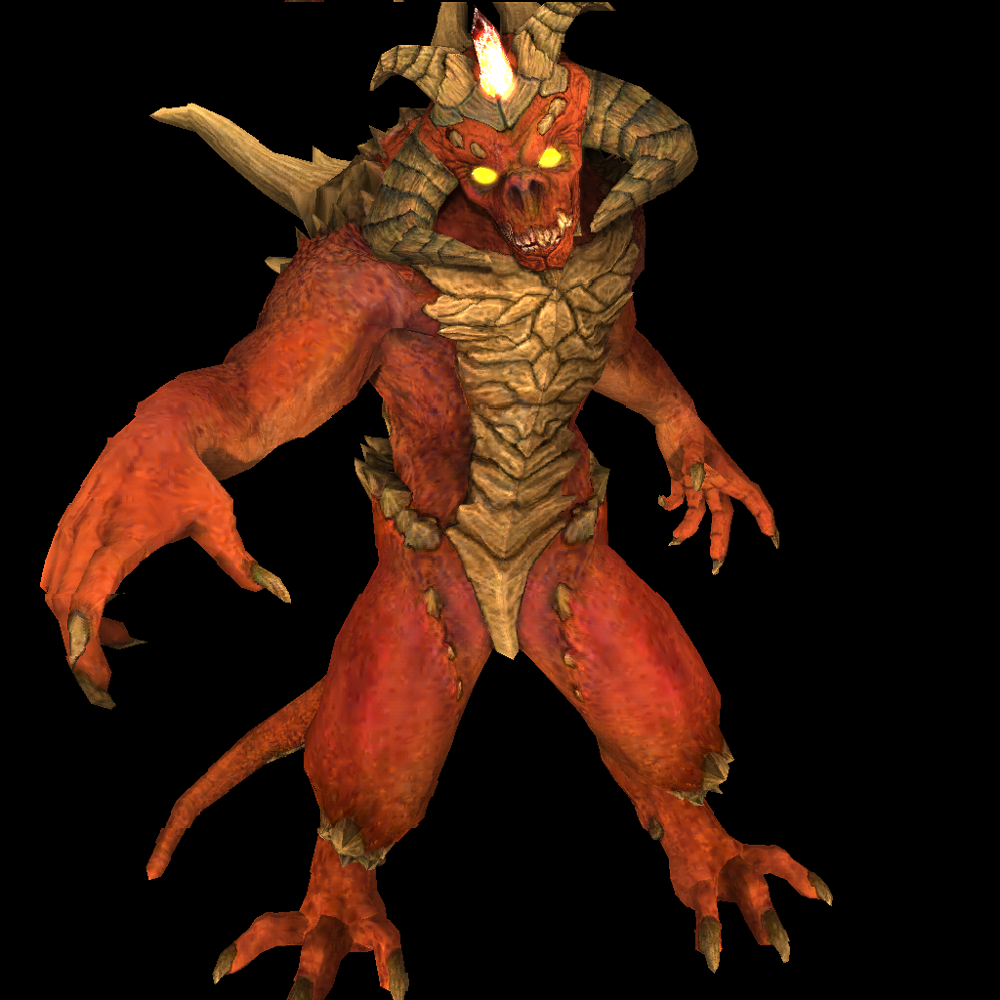

# Box
Box is a demo software renderer that demonstrates the combination of mathematics and the art of computer science. It introduces rasterization, a fundamental computer graphics technique. The code does not rely on any external dependencies and is written entirely in standard c++.



## Dependencies
Box follows the KISS principle (Keep it simple, stupid!). It does not rely on any external library dependency. Compiling the renderer requires only a C++17-compliant compiler.

However, because it lacks support from external libraries, the renderer's output is saved in a special format: [Netpbm](https://en.wikipedia.org/wiki/Netpbm). To view this special image format, install [ImageMagick](https://imagemagick.org/index.php) and use the command `display` to open the image.

Ubuntu:
```sh
sudo apt-get install imagemagick -y
```

Arch Linux:
```sh
sudo pacman -S imagemagick
```

## Background Knowledge
* Linear Algebra
* Encapsulation with Class
* Concept of Shader and the Underlying Algorithms

## Build & Run
In order to build the renderer, Create a directory called `build` and run CMake inside it.
```sh
mkdir build && cd build
cmake ..
cmake --build .
```
When the build is finished, return to the top-level directory and run the renderer. The renderer's output can be found at at `image.pam`
```sh
cd ..
build/box
display image.pam
```

## SITCON
This project is also a part of the agenda "High Performance Game Graphics: A Renderer From Scratch" at SITCON 2022 (Student's Information Technology Conference). The presentation slide can be found [here](docs/assets/slide.pptx).

[](https://youtu.be/4aVeYhMZn5I?list=PLemTXpRsr742NWJKLoXzth4gh7OdPzjvW)

## References
* [Tiny Renderer](https://github.com/ssloy/tinyrenderer)
* [Physically Based Rendering: From Theory to Implementation](https://www.pbrt.org/)
* [Fundamentals of Game Engine Development](https://foundationsofgameenginedev.com/)
* [Learn OpenGL](https://learnopengl.com/)
* [Fundamentals of Computer Graphics](https://www.amazon.com/Fundamentals-Computer-Graphics-Steve-Marschner/dp/1482229390)
* [Scratchapixel](https://www.scratchapixel.com/)
