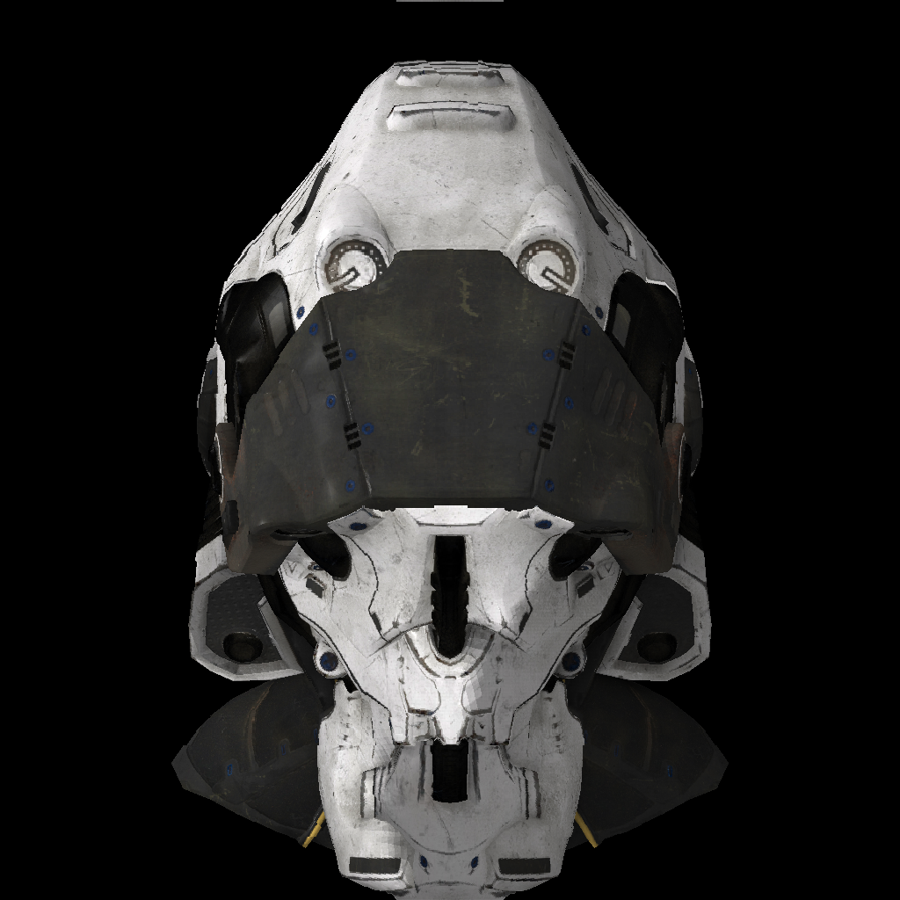

# Reddere
Reddere (/'rɛd.dɛ.rɛ/, the Latin root of the word "render") is a simple software renderer requiring no external libraries. It serves as an educational tool for beginners looking to delve into the mechanics of popular graphics APIs like OpenGL and Vulkan. Essentially, it unveils the inner workings of rasterization, the core algorithm behind most modern games, by implementing it using only the C++ Standard Library.

The following image is the iconic [SciFi Helmet](https://github.com/KhronosGroup/glTF-Sample-Assets/tree/main/Models/SciFiHelmet) 3D model, originally created by Michael Pavlovic and is available under the CC0 1.0 Universal license, rendered using Reddere.



## SITCON
This renderer is also the main part of my presentation titled "High Performance Game Graphics: A Renderer from Scratch" at SITCON X (2022/9/21), whose video recording can be found [on YouTube](https://www.youtube.com/watch?v=4aVeYhMZn5I&list=PLemTXpRsr742NWJKLoXzth4gh7OdPzjvW), and the slides are available [here](slides.pptx).


## Build Instructions
Run the following instructions to build Reddere:
```sh
mkdir build & cd build
cmake -DCMAKE_BUILD_TYPE=Release ..
cmake --build .
```

The compiled binary can then be found in the `build` directory. It should be run from the root of this repository so that it can locate assets using relative paths.

## References
* [Tiny Renderer](https://github.com/ssloy/tinyrenderer)
* [Physically Based Rendering: From Theory to Implementation](https://www.pbrt.org/)
* [Fundamentals of Game Engine Development](https://foundationsofgameenginedev.com/)
* [Learn OpenGL](https://learnopengl.com/)
* [Fundamentals of Computer Graphics](https://www.amazon.com/Fundamentals-Computer-Graphics-Steve-Marschner/dp/1482229390)
* [Scratchapixel](https://www.scratchapixel.com/)
